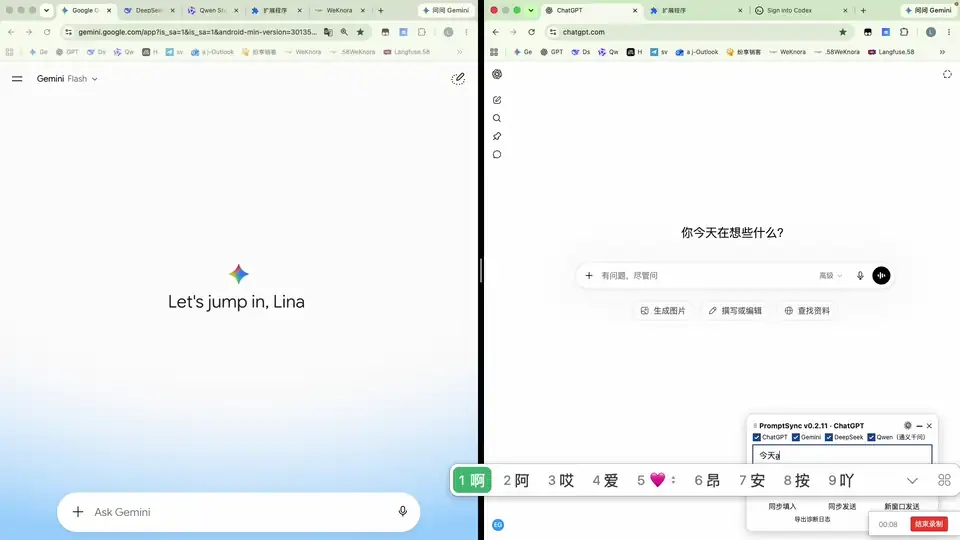
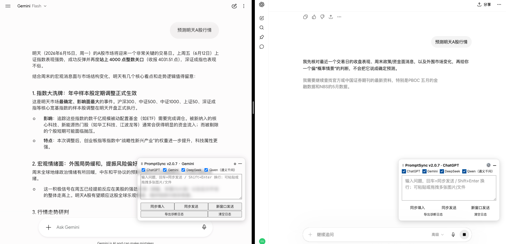
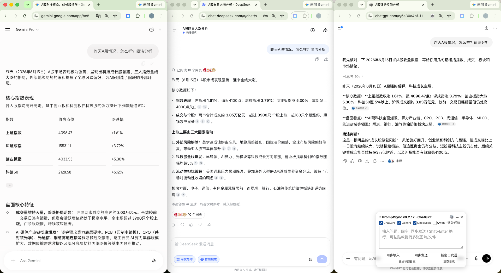

# PromptSync · 多 AI 同步提问-小工具

> **一次输入，同时发给 ChatGPT、Gemini、DeepSeek、通义千问，并排对比各家答案。**

[查看高清无声 MP4 演示（约 6.6 MB）](demo-raw.mp4)

一个浮动小窗，输入 / 粘贴 / 拖拽（支持多图多文件），**回车即同步发送**到你勾选的多个网页 AI；自动等图片上传完再发、单次发送绝不重复。

适合：同一个问题，想横向对比多家大模型怎么答 —— 不用再一家一家复制粘贴。

---

如图:

## ✨ 特性

- 🔁 **一处输入，多家同时提问** —— 回车一下，各平台齐刷刷开始回答
- 🖼 **多图 / 多文件** —— 粘贴或拖拽，自动等上传完成再发送
- 🆕 **新窗口发送** —— 各家先各开一个新对话再发，互不串台
- 🎯 **按需勾选** —— 这一条想发给哪几家，面板上一勾即可
- 🧩 **可视化配置** —— 站点选择器在设置页可改/可加，网站改版自己就能修
- 🛡 **稳** —— 单任务只发一次、跨标签去重、没发出去会安全补发
- 🔌 **独立扩展** —— 装一次即用，无需 Tampermonkey

## 🌐 支持平台

**ChatGPT · Gemini · DeepSeek · 通义千问（Qwen）**

> 其它网页 AI 可在设置页「➕ 新增站点」自助接入。

## 🔒 隐私与权限

> **PromptSync 无后端、无账号系统、无统计或埋点，不收集或上传你的聊天内容。**
>

## 📦 安装

> 暂未上架应用商店，先用「开发者模式加载」。两种取包方式任选其一。

**方式 A · 下载打包好的 zip（推荐，最省事）**

1. 到 [**Releases**](https://github.com/stormjiev/PromptSync/releases/latest) 下载 `promptsync-extension-vX.Y.Z.zip`
2. 解压得到一个文件夹
3. 浏览器打开 `chrome://extensions` → 右上角开 **开发者模式** → 点 **加载已解压的扩展程序** → 选中刚解压的文件夹

**方式 B · 用源码**

1. `git clone https://github.com/stormjiev/PromptSync.git`（或绿色 **Code → Download ZIP** 后解压）
2. 同上加载，目录选仓库里的 `extension/`

装好后，登录着打开任一支持的 AI 网站，右下角即出现同步面板 ✅

> 适用于 Chrome / Edge / Brave 等 Chromium 内核浏览器。

## 🚀 使用

1. 面板顶部勾选要同步的平台（默认全选）
2. 在输入框输入问题，或直接 **Ctrl/Cmd + V 粘贴图片**、拖拽文件进面板
3. **回车 = 同步发送**；**Shift + Enter = 换行**
4. 三个按钮按需选：
   | 按钮 | 作用 |
   |---|---|
   | **同步填入** | 只填入各家输入框，不发送（确认后手动发） |
   | **同步发送** | 在各家**当前对话**里发送 |
   | **新窗口发送** | 各家先开**新对话**再发送 |
5. 切到各 AI 的标签页，并排查看 / 对比答案

> 面板可拖动；右上角 ⚙ 打开设置、— 收起。

## ⚙️ 接入新站点 / 修复改版

设置页（面板 ⚙）→ **➕ 新增站点**：填域名 + 输入框、发送键等选择器（F12 看元素即可），授权后立即生效。
内置站点若因网站改版失效，也在这里改选择器即可自助修复，无需等更新。

## ⚠️ 说明

- 各 AI 需**保持登录**，且在**同一浏览器**内
- 图片经浏览器存储在标签间传递，建议单文件控制在数 MB 内
- 仅供个人少量使用，请遵守各平台服务条款

---

> 想了解实现细节见 [`extension/README.md`](extension/README.md)。原 Tampermonkey 脚本版保留在 [`dual-ai-sync.user.js`](dual-ai-sync.user.js)。建议与问题可在 [GitHub Issues](https://github.com/stormjiev/PromptSync/issues) 留言。
